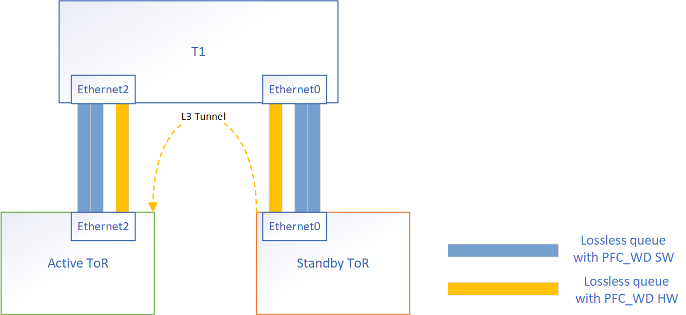

# PFC Watchdog by hardware
# Table of Content
# List of Tables
# About this Manual
# Scope
This document describes the high level design of PFC watchdog by hardware on Broadcom TH and TD3 platforms.
# Definitions/Abbreviation
##### Table 1  Definitions
|Definitions/Abbreviation|Description|
|----|----|
|PFC_WD SW|PFC watchdog detection and recovery implemented by software, such as ACL.|
|PFC_WD HW|PFC watchdog  detection and recovery implemented by hardware|
|TC| Traffic class|

# Introduction
PFC watchdog is designed to detect and mitigate PFC storm received for each port.

PFC pause frame is used in lossless Ethernet to pause the link partner from sending packets. Such back-pressure mechanism could propagate to the whole network and cause the network stop forwarding traffic. 

PFC watchdog is to detect abnormal back-pressure caused by receiving excessive PFC pause frames, and mitigate such situation by disable PFC caused pause temporarily. PFC watchdog has three function blocks, i.e. detection, mitigation and restoration.
* Storm Detection: Detect the PFC pause storm if it keeps happening for certain time for a non-drop class.
* Storm Mitigation: Restore the Storm by dropping all packets of the non-drop class. 
* Storm Restoration: PFC watchdog will continue counting the PFC frames received on the queues. If there is no PFC frame received over restoration_time period. Then, re-enable the PFC on the queue and stop dropping packets if the previous mitigation was drop.

Currently, there are 2 lossless queues in SONiC by dafault. The default actions for PFC mitigation is dropping packets at both ingress and egress stage.
On Broadcom platform, the packet drop is implemented by ACL.
* Ingress stage

    Create a shared ACL table for all lossless queues to match `TC` and `IN_PORT`, and drop any received packets.
* Egress stage

    Create individual ACL tables for different lossless queues to match `TC`, and drop any egressed packets.

In Gemini scenario, the downstream traffic from T1 to standby ToR is forwarded to active ToR via a IP tunnel. To ensure a lossless transmit and avoid consuming the volume of current lossless queues, another lossless queue is required.
Limited by TCAM resources, we are not able to add another PFC watchdog since another lossless queue requires another EGRSS ACL table to drop packets. Therefore, we are going to add a new mechanism to implement PFC_WD by hardware.



# Design
## PFC storm detection
The hardware PFC watchdog will reuse current mechanism to detect PFC storm.
## PFC storm mitigation
We need to drop packets at both INGRESS and EGRESS stage to mitigate PFC storm.
### Ingress drop
There are two options to drop packets at ingress stage

* Option 1 Reuse the ingress ACL table for software watchdog
* Option 2 Set zero profile to the priority group

### Egress drop
To drop packet at EGRESS stage, we are going to set `SAI_QUEUE_ATTR_PFC_DLR_INIT` to `true`.
```cpp
// Step1: Set the recovery action to 'DROP'
sai_attribute_t attr;
attr.id = SAI_SWITCH_ATTR_PFC_DLR_PACKET_ACTION;
attr.value.s32 = SAI_PACKET_ACTION_DROP;
status = sai_switch_api->set_switch_attribute(switch_id, 1, attr);

// Step2: Start PFC recovery
attr.id = SAI_QUEUE_ATTR_PFC_DLR_INIT;
attr.value.bool = true;
status = sai_queue_api->set_queue_attribute(oid, 1, attr);
```
## PFC storm recovery
We need to set `SAI_QUEUE_ATTR_PFC_DLR_INIT` to `false` to restore queue from deadlock/storm state.
```cpp
// Stop PFC recovery
sai_attribute_t attr;
attr.id = SAI_QUEUE_ATTR_PFC_DLR_INIT;
attr.value.bool = false;
status = sai_queue_api->set_queue_attribute(oid, 1, attr);
```
The attribute `SAI_QUEUE_ATTR_PFC_DLR_INIT` is supported from BCM SAI 4.3.

# Questions
1. Why can we only have up 2 software watchdog? Is there any other limitations besides TCAM?
2. Read & clear counters
3. The new lossless queue will share buffer with existing queues, so actually it still take resources from other queues. 
4. How is the tunnel traffic mapped to the new lossless queue?

# TODOs
1. Confirm packet at EGRESS stage will be dropped when `SAI_QUEUE_ATTR_PFC_DLR_INIT = true`
